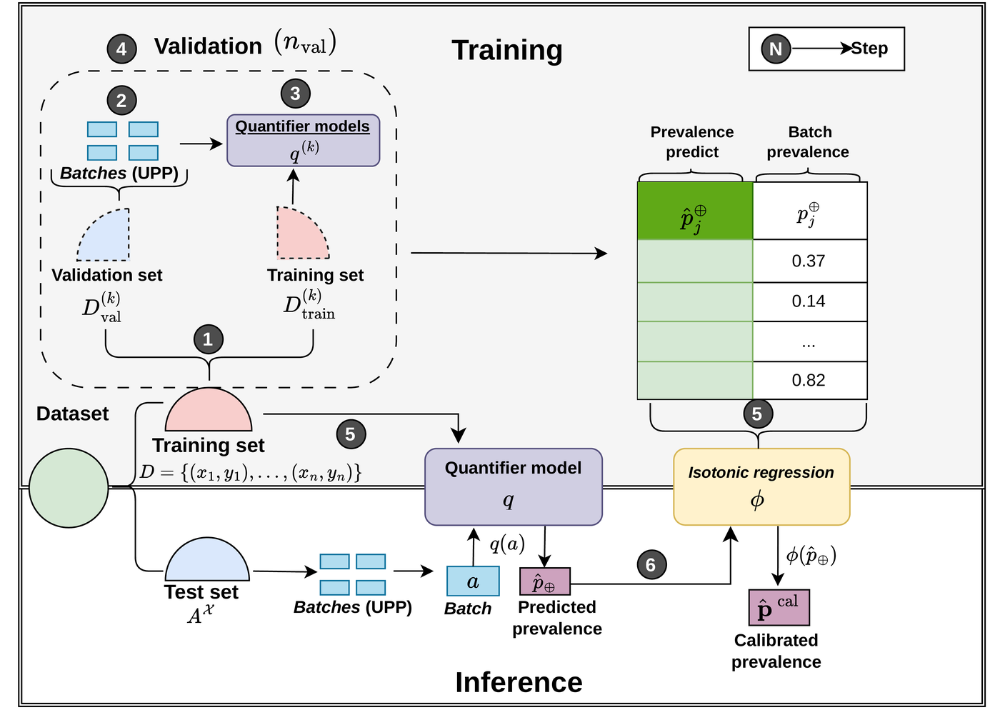
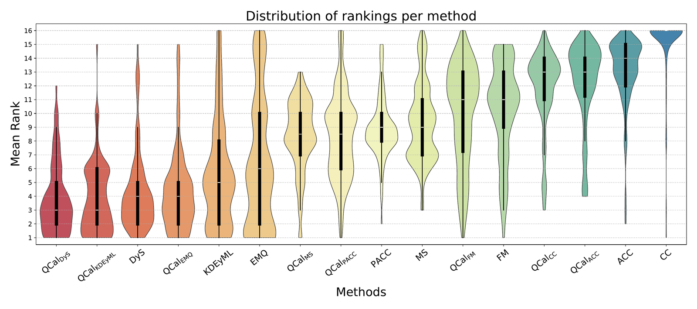

# QCal: Post-hoc Calibration for Binary Quantifiers

Code and data for the paper **"On Binary Quantification Calibration"** by
Isabella Caroline Sachini Lorena, André Maletzke and Willian Zalewski, accepted
at the QCDS 2026 workshop (ECML/PKDD 2026).

**QCal** is a post-hoc calibration method for binary quantifiers. It learns a
correction function that maps a quantifier's raw prevalence estimates to
corrected ones, fitted by isotonic regression on pairs collected from
validation batches with artificially controlled prevalences. The correction is
constrained to be non-decreasing and bounded to [0, 1], so it absorbs the
systematic bias the quantifier leaves in its estimates while always returning a
valid prevalence. QCal assumes no parametric form for the correction, requires
no separate derivation for each quantifier, and applies unchanged to any binary
quantifier.

<p align="center">
  
</p>

Training (Steps 1–5) splits the training set, generates validation batches with
UPP, trains an internal quantifier on each repetition and collects the pairs
(raw estimate, true batch prevalence); the correction function is then fitted on
those pairs by isotonic regression, while the final quantifier is trained on the
complete training set. At inference (Step 6) the base quantifier estimates the
prevalence of a test batch and the correction is applied to it.

---

## Repository structure

```
.
├── README.md                     # this file
├── requirements.txt              # Python dependencies
├── run_experiment.py             # main experiment pipeline (106 datasets)
├── config.py                     # dataset list and experiment constants
├── analyze_results.py            # aggregates results into Table 1 and Fig. 2
├── calibrator/
│   └── QCal_iso.py               # the QCal class (Algorithms A.1 and A.2)
├── utils_qcal/
│   ├── protocol.py               # APP and UPP (Kraemer) sampling protocols
│   ├── extract_estimates.py      # classifier training + estimate extraction
│   ├── calibrator_classifier.py  # BCTS calibrated classifier
│   ├── median_estimates.py       # aggregation helpers
│   └── qcal_plots.py             # diagnostic figures (Figs. B.1 and B.2)
├── datasets/                     # 106 binary datasets (CSV, label column `target`)
└── figures/                      # figures shown in this README
```

---

## Requirements

- Python 3.x
- `numpy`, `pandas`, `scikit-learn`, `mlquantify`, `quapy`, `scikit-posthocs`,
  `scipy`, `matplotlib`

```bash
pip install -r requirements.txt
```

---

## Datasets

106 binary datasets from OpenML and the UCI repository, retained only if the
minority class has at least 150 instances. They range from 625 to 245,057
instances, from 2 to 970 attributes, and from roughly 4% to 50% minority-class
proportion. Each CSV has the label in a column named `target`.

---

## Reproducing the experiments

```bash
nohup python3 -u run_experiment.py > log.out 2>&1 &
```

Setup, following Section 5.2 of the paper:

| Component | Configuration |
|:---|:---|
| Base classifier | Logistic Regression, default parameters, uncalibrated |
| Base quantifiers | CC, ACC, PACC, EMQ, FM, DyS, MS (mlquantify), KDEy-ML (QuaPy) |
| Validation split (Step 1) | stratified 70/30 |
| Protocol (Step 2) | UPP via Kraemer, `batch_size = 100`, `R = 1100` |
| Validation repetitions | `n_val = 3`, giving 3300 calibration pairs |
| Correction function | isotonic regression, non-decreasing, bounded to [0, 1] |
| Evaluation | 30 stratified 70/30 train/test splits per dataset; UPP over the test portion; MAE |

No probability calibration is applied to the classifier: since logistic
regression minimizes a strictly proper scoring rule, its posteriors are already
approximately calibrated, which leaves QCal as the only source of correction.

Per-split results are written to `results/calibration_experiment/split_<n>/`,
one CSV of MAE values and one of predicted prevalences per dataset. Tracebacks
from parallel workers go to `logs/errors_<pid>.log`. Aggregate everything with:

```bash
python3 analyze_results.py
```

which produces Table 1 (mean MAE, relative reduction, win/loss counts, average
ranks and Holm-corrected Wilcoxon p-values) and Fig. 2 (distribution of the
per-dataset ranks of the 16 methods).

---

## Using QCal

All QCal variants come from a single class; the base quantifier is selected by
`method_name`, and `n_validation` sets the number of validation repetitions.
This replaces the earlier one-class-per-quantifier layout (`QCal_isot_3`,
`QCal_isot_3_ms`, ...), which no longer exists.

```python
from calibrator.QCal_iso import QCal
from sklearn.linear_model import LogisticRegression

model = QCal(
    learner=base_clf,                  # already-fitted base classifier
    method_name='dys',                 # cc | acc | pac | dys | ms | emq | fm | kde | hdx
    clf=LogisticRegression(),          # classifier refitted inside the validation loop
    n_validation=3,
)
model.fit(X_train, y_train)
prev = model.predict(batch)            # array([prev_negative, prev_positive])
```

`QCal` also exposes the figures of Appendix B: `plot_calibration()` draws the
calibration pairs and the fitted correction function (Fig. B.1, in-sample), and
`plot_test_calibration(X_test, y_test)` draws raw versus corrected estimates on
held-out test batches (Fig. B.2, out-of-sample).

---

## Results

QCal reduces the mean MAE of every base quantifier over the 106 datasets, and
all eight improvements remain significant at the 5% level after Holm correction.

| | MAE *q* | MAE QCal(*q*) | Δ | W/L | Rank *q* | Rank QCal(*q*) | p-value |
|:---|---:|---:|---:|:---:|---:|---:|---:|
| CC | .1780 ± .1543 | **.0910** ± .0810 | 48.9% | 102/4 | 15.27 | 11.72 | 6.5e−18 |
| ACC | .1191 ± .1361 | **.0913** ± .0809 | 23.4% | 62/44 | 13.10 | 12.18 | 8.8e−05 |
| PACC | .0808 ± .0972 | **.0686** ± .0626 | 15.1% | 57/49 | 8.93 | 8.41 | 2.3e−02 |
| EMQ | .0820 ± .0963 | **.0656** ± .0644 | 20.0% | 70/36 | 6.41 | 4.38 | 4.3e−06 |
| FM | .0861 ± .1004 | **.0735** ± .0663 | 14.7% | 58/48 | 10.34 | 9.95 | 4.1e−03 |
| DyS | .0757 ± .0991 | **.0637** ± .0614 | 15.9% | 59/47 | 4.30 | 3.77 | 2.3e−02 |
| MS | .0962 ± .1182 | **.0759** ± .0682 | 21.0% | 53/53 | 9.31 | 8.40 | 2.3e−02 |
| KDEy-ML | .0849 ± .1147 | **.0636** ± .0629 | 25.2% | 70/36 | 5.70 | 3.83 | 3.0e−07 |

MAE is the mean ± standard deviation across datasets; lower is better. Δ is the
relative reduction of the mean MAE obtained by QCal(*q*) over *q*. W/L counts
the datasets on which QCal(*q*) achieves a lower / higher MAE than *q*; they sum
to 106, as no exact ties occurred. Rank is the average rank of the method among
all 16, lower is better. The p-value comes from a two-sided Wilcoxon signed-rank
test over the 106 per-dataset MAE scores, Holm-corrected for the eight
comparisons.

The gain is largest for CC (48.9%), the only method that applies no correction
of its own, and smallest for the quantifiers that already model the shift
explicitly, such as FM (14.7%) and PACC (15.1%).

<p align="center">
  
</p>

Ranking the 16 methods by MAE on each dataset gives the distribution above,
sorted by increasing average rank. The ordering is strictly paired: every
QCal(*q*) appears to the left of its own base quantifier, without exception.
Notably, QCal applied to plain CC reaches a better average rank than ACC, a
method designed specifically to correct CC.

---

## License

Released under the MIT License. See [`LICENSE`](LICENSE) for the full text.
